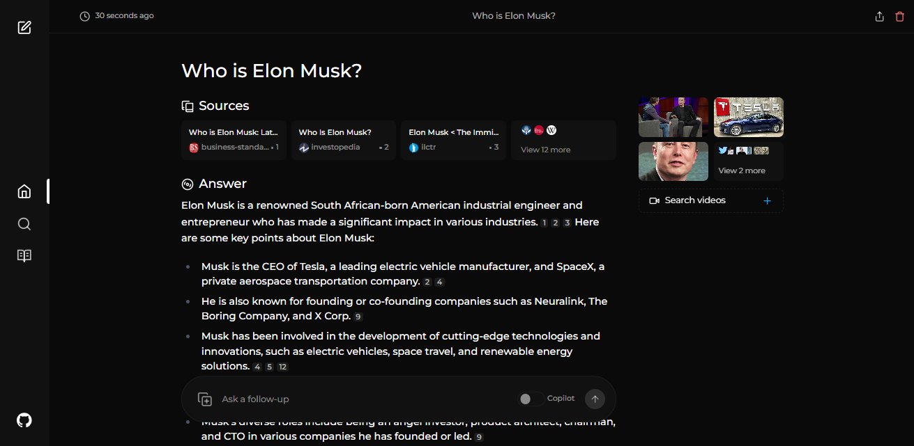

# 🚀 ved - An AI-powered search engine 🔎 <!-- omit in toc -->

## Table of Contents <!-- omit in toc -->

- [Overview](#overview)
- [Preview](#preview)
- [Features](#features)

## Overview
Ved-AI is a personalized assistant and second brain that aims to revolutionize the way students learn and understand concepts. The platform is designed to provide reliable information, understand individual learning styles, and offer personalized learning experiences.

ved i summed up as AI-powered learning companion with an AI-powered search engine that goes deep into the internet to find answers.Inspired by AI, it's an powerful option that not just searches the web but understands your questions. It uses advanced machine learning algorithms like similarity searching and embeddings to refine results and provides clear answers with sources cited.

Using SearxNG to stay current, ved ensures you always get the most up-to-date information without compromising your privacy.

Want to know more about its architecture and how it works? You can read it in our medium post.
## Preview

## Features

- **Local LLMs**: You can make use local LLMs such as Llama3 and Mixtral using Ollama.
- **Two Main Modes:**
  - **Copilot Mode:** (In development) Boosts search by generating different queries to find more relevant internet sources. Like normal search instead of just using the context by SearxNG, it visits the top matches and tries to find relevant sources to the user's query directly from the page.
  - **Normal Mode:** Processes your query and performs a web search.
- **Focus Modes:** Special modes to better answer specific types of questions. ved currently has 6 focus modes:
  - **All Mode:** Searches the entire web to find the best results.
  - **Writing Assistant Mode:** Helpful for writing tasks that does not require searching the web.
  - **Academic Search Mode:** Finds articles and papers, ideal for academic research.
  - **YouTube Search Mode:** Finds YouTube videos based on the search query.
  - ** Mode:** Answers queries that need calculations or data analysis using Wolfram Alpha.
  - **Reddit Search Mode:** Searches Reddit for discussions and opinions related to the query.
- **Current Information:** Some search tools might give you outdated info because they use data from crawling bots and convert them into embeddings and store them in a index. Unlike them, ved uses SearxNG, a metasearch engine to get the results and rerank and get the most relevant source out of it, ensuring you always get the latest information without the overhead of daily data updates.
- **API**: Integrate ved into your existing applications and make use of its capibilities.

